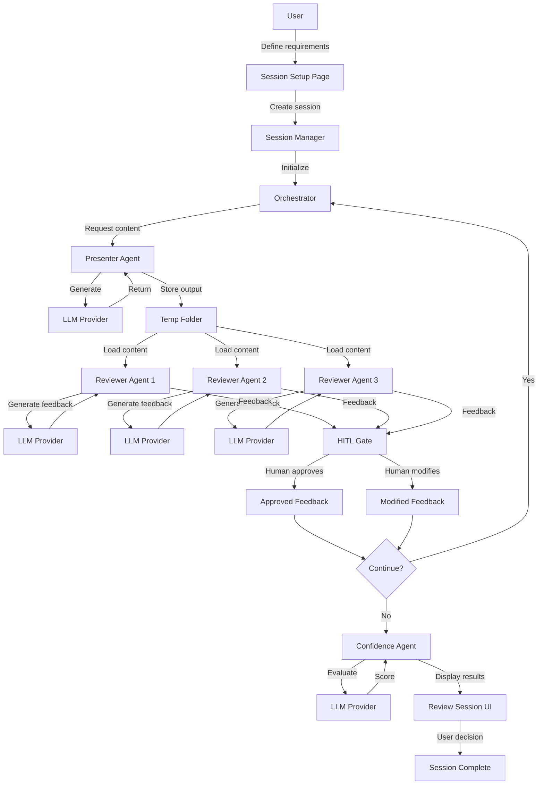

# 🏗️ **AGENT REVIEW BOARD - ARCHITECTURE**

---

## **1. High-Level Description**

### What is Agent Review Board?

**Agent Review Board (ARB)** is a multi-agent system designed to iteratively refine responses through collaborative review. The system employs:

* **Presenter Agent** — Generates content based on requirements
* **Reviewer Agents** — Multiple specialized agents that critique and provide feedback
* **Confidence Agent** — Evaluates overall quality and convergence
* **Human-In-The-Loop (HITL)** — Mandatory human approval at each iteration

### Why HITL is Mandatory

Human oversight ensures:

* Quality control at each iteration
* Prevention of agent drift or hallucination accumulation
* Alignment with actual user intent
* Ethical and appropriate content generation

### Incognito Memory Model

* **No persistent storage** — All session data lives in memory only
* **Session-scoped** — Data cleared on browser refresh or session end
* **Temporary files only** — Optional temp folder under `/tmp/<session_id>/`
* **Privacy-first** — No API keys or user content stored to disk

### High-Level Agent Flow

1. **User** defines requirements and selects reviewer roles
2. **Presenter Agent** generates initial content
3. **Reviewer Agents** (2-3 specialized roles) provide structured feedback
4. **HITL Gate** — Human reviews and approves/modifies feedback
5. **Next Iteration** — Presenter uses approved feedback to improve
6. **Confidence Agent** — Evaluates convergence and quality
7. **Repeat** until confidence threshold met or user satisfied

---

## **2. Component Architecture**

### `ui/` — Streamlit UI Components

**Purpose:** All user interface logic using Streamlit

**Components:**

* `pages/start_session.py` — Session setup, requirements input, role selection
* `pages/llm_settings.py` — LLM provider configuration, API key management
* `pages/review_session.py` — Main review board interface with 3-panel layout
* `components/` — Reusable UI widgets (banners, cards, controls)

**Rules:**

* Only layer allowed to import Streamlit
* Must not contain business logic
* Calls into `core/` for all state management and orchestration

---

### `core/` — Session Management & Orchestration

**Purpose:** Business logic, state management, iteration control

**Components:**

* `session_manager.py` — Session lifecycle, state persistence (in-memory)
* `orchestrator.py` — Coordinates agent execution flow
* `hitl_controller.py` — Manages human approval workflow

**Rules:**

* NO Streamlit imports
* Pure Python business logic
* Receives dependencies via dependency injection
* Stateless functions where possible

---

### `agents/` — Agent Classes

**Purpose:** Individual agent implementations

**Components:**

* `presenter.py` — `PresenterAgent` class
* `reviewer.py` — Base `ReviewerAgent` class and specialized subclasses
* `confidence.py` — `ConfidenceAgent` class
* `base_agent.py` — Abstract base class for all agents

**Agent Shared Memory Format:**

```python
{
    "iteration": int,
    "presenter_output": str,
    "reviews": [
        {
            "role": str,
            "feedback": List[str],  # max 5-8 bullet points
            "approved": bool
        }
    ],
    "confidence_score": float
}
```

**Rules:**

* NO Streamlit imports
* Receive LLM provider via dependency injection
* Implement clear interface methods
* Keep agents stateless (state in SessionManager)

---

### `llm/` — LLM Provider Abstraction

**Purpose:** Unified interface for multiple LLM providers

**Components:**

* `base_provider.py` — Abstract `BaseLLMProvider` class
* `mock_provider.py` — Deterministic mock for testing
* `openai_provider.py` — OpenAI API integration (future)
* `anthropic_provider.py` — Anthropic API integration (future)
* `local_provider.py` — Local model integration (future)

**Interface Contract:**

```python
class BaseLLMProvider(ABC):
    @abstractmethod
    def generate_text(self, prompt: str, **kwargs) -> str:
        """Generate text from prompt"""
        pass
    
    @abstractmethod
    def list_models(self) -> List[str]:
        """List available models"""
        pass
```

**Rules:**

* NO Streamlit imports
* All providers implement same interface
* Unified error handling
* No provider-specific logic in agents

---

### `models/` — Pydantic Data Models

**Purpose:** Type-safe data structures for messages, states, feedback

**Components:**

* `session_state.py` — `SessionState` model
* `message.py` — `Message` model for agent communications
* `feedback.py` — `Feedback` model for reviewer output
* `config.py` — `LLMConfig`, `AgentConfig` models

**Rules:**

* NO Streamlit imports
* Use Pydantic for validation
* Immutable where appropriate
* Clear type definitions

---

### `utils/` — Utilities

**Purpose:** Shared utility functions

**Components:**

* `file_utils.py` — Temp folder creation/cleanup, file handling
* `logging_utils.py` — Structured logging setup
* `config_utils.py` — Configuration loading

**Rules:**

* NO Streamlit imports
* Stateless utility functions
* Well-documented helpers

---

## **3. Runtime Flow Diagram**



---

## **4. Data Flow**

### Session Initialization

```
User Input → SessionManager → Create Session State (in-memory)
                            ↓
                    Generate session_id
                            ↓
                    Create temp folder /tmp/<session_id>/
                            ↓
                    Initialize Orchestrator
```

### Iteration Cycle

```
1. Orchestrator → Presenter Agent
2. Presenter → LLM Provider → Generated Content
3. Content → Temp Folder
4. Temp Folder → Reviewer Agents (parallel)
5. Reviewers → LLM Provider → Feedback (5-8 bullets each)
6. Feedback → HITL UI
7. Human → Approve/Modify
8. Approved Feedback → SessionManager
9. SessionManager → Check confidence threshold
10. If not met → Loop to step 1
```

### Session Termination

```
User Ends Session → Orchestrator cleanup
                            ↓
                    Clear session state
                            ↓
                    Delete temp folder
                            ↓
                    Clear API keys from memory
```

---

## **5. Security Considerations**

### API Key Management

* Stored only in Streamlit session state (memory)
* Never written to disk or logs
* Cleared on session end
* Masked in UI

### File Upload Safety

* Uploaded files stored in session-specific temp folder
* Folder path includes random session_id
* Automatic cleanup on session end
* No persistent storage

### No Data Leakage

* No session data survives browser refresh
* No cross-session data sharing
* No analytics or telemetry
* Privacy-first design

---

## **6. Extensibility Points**

### Adding New LLM Providers

1. Subclass `BaseLLMProvider`
2. Implement `generate_text()` and `list_models()`
3. Register in provider factory
4. Add to UI provider dropdown

### Adding New Reviewer Roles

1. Subclass `ReviewerAgent`
2. Define specialized prompt template
3. Register in role registry
4. Add to UI role selection

### Adding New Agent Types

1. Subclass `BaseAgent`
2. Implement required interface
3. Update Orchestrator flow
4. Add UI components

---

## **7. Testing Strategy**

### Unit Tests

* Test each component in isolation
* Mock all LLM providers
* No network calls
* Fast execution

### Integration Tests

* Test component interactions
* Use MockLLMProvider
* Test full iteration cycle
* Verify HITL gates

### UI Tests

* Test page imports
* Test component rendering
* Mock core dependencies
* No Streamlit server required

---

**This architecture ensures maintainability, testability, and clear separation of concerns.**

